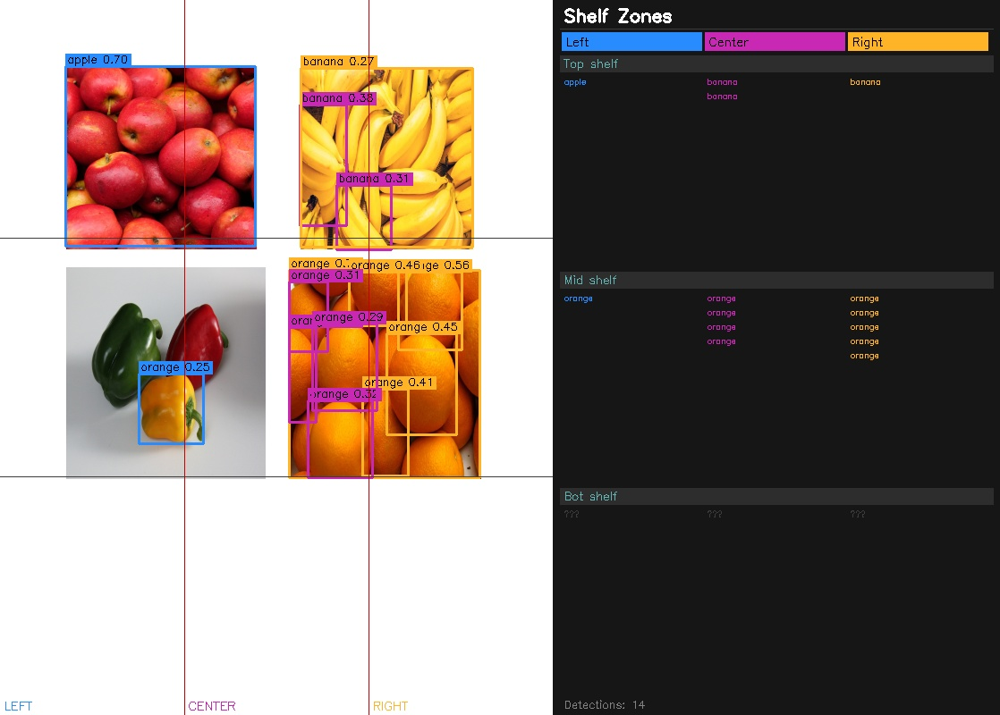

# InNavi — Indoor Navigation System

Real-time indoor navigation using computer vision. The system detects aisle signs, ArUco markers, and shelf products from a webcam feed and updates a live minimap to guide users through a store.

---

## Repository Structure

```
InNavi/
├── frontend/                  React web app (store map + navigation)
└── cv_testing/
    ├── sign_detection/        EasyOCR aisle sign reader + minimap
    ├── marker/                ArUco marker detector + minimap
    └── product_detection/     YOLOv8 shelf product detector
```

---

## Frontend

Interactive store map built with React + Vite. Works as a standalone demo — no backend required.

**Features**
- Store map with all aisles rendered from embedded graph data
- Demo navigation mode (Dijkstra + nearest-neighbor routing)
- Pipeline tab for live CV feed (requires backend)

**Setup**
```bash
cd frontend
npm install
npm run dev
```

**Deploy to Vercel**
1. Import this repo on [vercel.com](https://vercel.com)
2. Set root directory to `frontend`
3. Build command: `npm run build` | Output: `dist`
4. Leave `VITE_API_URL` blank for demo mode, or point it at your backend

---

## CV Testing Modules

### Prerequisites

```bash
pip install opencv-contrib-python easyocr ultralytics torch torchvision transformers pillow
```

> YOLO model weights (`yolov8n.pt`) are downloaded automatically on first run. Not included in this repo.

---

### Sign Detection — `cv_testing/sign_detection/`

Reads aisle signs using EasyOCR and updates a live minimap as you walk through the store.

| File | Description |
|---|---|
| `ocr_webcam_test.py` | Webcam feed + OCR + live minimap. Logs detection timing to CSV. |
| `minimap_ocr.py` | Minimap-only variant, no external CSV output. |

**Run**
```bash
cd cv_testing/sign_detection
python ocr_webcam_test.py
```

**How it works**
- EasyOCR scans every 3 frames (GPU-accelerated) for aisle labels like `A152`, `A100`
- Matched labels update the "You are here" position on the minimap
- Detection time and map update time are logged to `ocr_results_log.csv`

---

### Marker Detection — `cv_testing/marker/`

Uses printed ArUco markers as aisle position beacons. Faster and more reliable than OCR in low-light environments.

| File | Description |
|---|---|
| `aruco_detector.py` | Webcam + ArUco detection + live minimap |
| `aruco_minimap.py` | Route-aware variant with timing logs |
| `generate_markers.py` | Generates a printable marker sheet (10 markers, 2×5 grid) |

**Run**
```bash
cd cv_testing/marker

# Generate and print markers
python generate_markers.py        # saves marker_sheet.png

# Run the detector
python aruco_detector.py
```

**Marker → Aisle mapping**

| Marker ID | Aisle | Location |
|---|---|---|
| 0 | A152 | Bakery |
| 1 | A100 | Dairy |

Hold the printed marker in front of the webcam. The minimap updates instantly when detected. Detection timing is logged to `aruco_detector_log.csv`.

---

### Product Detection — `cv_testing/product_detection/`

Detects grocery products on shelves using YOLOv8. Divides the frame into a 3×3 zone grid (Left/Center/Right × Top/Mid/Bot) and lists what's in each zone.

| File | Description |
|---|---|
| `shelf_detector.py` | Live webcam shelf detector |
| `test_image.py` | Run detection on a static image |
| `grocery_preview.png` | Sample test image (fruits + vegetables) |
| `result.jpg` | Detection output for the sample image |

**Run**
```bash
cd cv_testing/product_detection

# Live webcam
python shelf_detector.py

# Static image test
python test_image.py
```

**Sample output**



The detector uses `yolov8n.pt` (COCO classes). For best results, place the camera facing a shelf section squarely.

---

## Demo Route

All CV modules share the same demo route used for minimap navigation:

```
Entrance → A152 (Bakery) → A100 (Dairy) → A1 → A2 → A100 → A34 (Yogurt) → A101 (Meat) → Checkout
```

This matches a milk + eggs + pasta shopping path through the store.

---

## Controls

| Key | Action |
|---|---|
| `Q` | Quit any CV script |

All webcam windows open fullscreen automatically.

---

## Tech Stack

| Layer | Technology |
|---|---|
| Frontend | React, Vite, CSS |
| Sign detection | EasyOCR, OpenCV |
| Marker detection | OpenCV ArUco (DICT_4X4_50) |
| Product detection | YOLOv8n (Ultralytics) |
| Depth estimation | MiDaS (available locally, not in this repo) |
| Floor segmentation | SegFormer-b0 ADE20K (available locally, not in this repo) |
